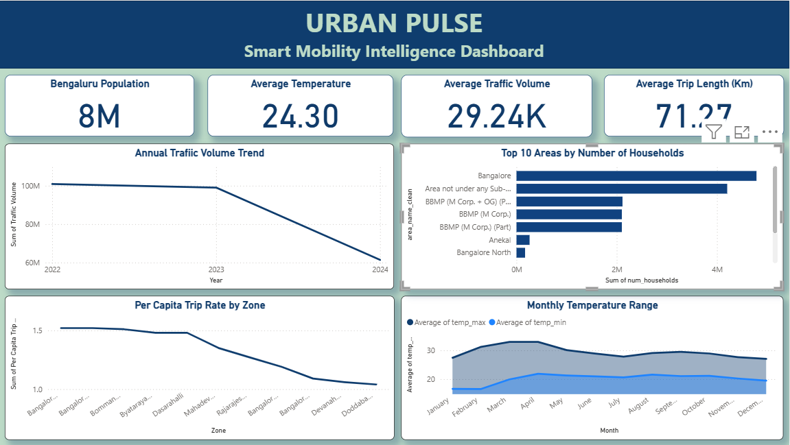

# Milestone 1 — Data Acquisition, Cleaning & Dimensional Modelling

**Project:** UrbanPulse — Smart City Mobility Intelligence Platform
**City studied:** Bangalore
**Deliverables:** cleaned datasets, star-schema data model, Power BI dashboard

---

## 1. Objective

Modern cities generate transport data from buses, metro, ride-hailing apps, cycling
systems, traffic sensors and weather stations — but each source sits in its own silo.
Planners therefore never see the network as a whole, which leads to congestion, poor
route planning and slow decisions.

Milestone 1 addressed the foundation of that problem: **acquire four unconnected
Bangalore datasets, clean them to a consistent standard, and join them into a single
queryable model** that later milestones could build on.

## 2. Datasets acquired

| Dataset | File | Rows | Cols | Content |
|---|---|---:|---:|---|
| Traffic | `cleaned_bangalore_traffic.csv` | 8,936 | 19 | Volume, avg speed, travel-time index, congestion, incidents by road & date |
| Weather | `banglore_weather_cleaned.csv` | 366 | 17 | Daily temp, humidity, precipitation, wind, cloud cover (1 full year) |
| Demographic | `Bangalore_Demographic_dataset_cleaned.csv` | 872 | 11 | Households, population, workers, literacy by area level |
| Mobility | `mobility_clean.csv` | 11 | 20 | Zone-level population density, income, and mode-share splits |

## 3. Cleaning approach

Carried out in [`../code/Step0_Data_Cleaning.ipynb`](../code/Step0_Data_Cleaning.ipynb):

1. **Deduplication** — removed repeated records across all four sources.
2. **Date standardisation** — parsed mixed date formats into a single `datetime` type,
   which was a prerequisite for building the date dimension.
3. **Percentage conversion** — mode-share and utilisation fields arrived as text
   percentages; converted to numeric so they could be aggregated.
4. **Quality validation** — checked null rates and value ranges before accepting a
   table as clean.

## 4. The joining problem, and how it was solved

The four datasets shared no common key. Traffic data was keyed by **area name**
(Indiranagar, Whitefield, Koramangala…) while mobility and demographic data were keyed
by **administrative zone** (Bangalore East, Mahadevapura, Bommanahalli…).

A bridge table was built to resolve this — see
[`../code/build_area_zone_bridge.py`](../code/build_area_zone_bridge.py) — mapping each
locality to its zone:

| Area | Zone |
|---|---|
| Indiranagar, M.G. Road | Bangalore East |
| Koramangala, Electronic City | Bommanahalli |
| Jayanagar | Bangalore South |
| Whitefield | Mahadevapura |
| Hebbal | Byatarayanapura |
| Yeshwanthpur | Dasarahalli |

With `Zone` established as the common key, every source could be joined.

## 5. Star schema

Built by [`../code/merge_final.py`](../code/merge_final.py), which also prints match
rates at each join so data loss is visible rather than silent.

```
                 dim_date (952 rows)
                      |
                      | Date
                      v
   dim_zone  <---- fact_traffic (8,936 rows x 39 cols)
   (11 rows)   Zone
                      
   fact_transit_routes (2,199)    fact_transit_stops (716)
```

| Table | Type | Rows | Purpose |
|---|---|---:|---|
| `fact_traffic` | Fact | 8,936 | Traffic + weather + demographic context per road per day |
| `dim_zone` | Dimension | 11 | Zone attributes: density, income, mode share, population |
| `dim_date` | Dimension | 952 | Year, month, day-of-week, weekend flag |
| `fact_transit_routes` | Fact | 2,199 | Bus routes with zone mapping |
| `fact_transit_stops` | Fact | 716 | Stops with coordinates and distance to zone centroid |

Weather was deliberately **not** joined into the fact table — daily weather has no road
dimension, so forcing the join would have fanned out rows. It is surfaced as a separate
reference chart in the dashboard instead.

## 6. Dashboard



[`../dashboard/Milestone-1-Dashboard.pbix`](../dashboard/Milestone-1-Dashboard.pbix)

### KPI cards

| Metric | Value |
|---|---|
| Bengaluru population | 8M |
| Average temperature | 24.30 °C |
| Average traffic volume | 29.24K |
| Average trip length | 71.27 km |

### Visuals and what they show

| Visual | Observation |
|---|---|
| Annual Traffic Volume Trend | Volume **falls from ~100M (2022) to ~60M (2024)** — a decline of roughly 40% |
| Top 10 Areas by Households | Dominated by the Bangalore and BBMP administrative aggregates |
| Per Capita Trip Rate by Zone | Declines from ~1.5 in central zones to ~1.05 in Devanahalli and Doddaballapura |
| Monthly Temperature Range | Max and min tracked monthly; peak spread around March–April |

### Two observations worth carrying forward

1. **Traffic volume declined sharply across the three-year window.** A 40% drop is large
   enough that it should be verified against the source before being presented as a real
   trend — it may reflect changing sensor coverage rather than falling traffic.

2. **Per-capita trip rate falls with distance from the centre.** Central zones generate
   ~1.5 trips per capita against ~1.05 in outer zones. This is the same
   centre-versus-periphery access gap that Milestone 4 later quantifies formally in
   Visakhapatnam — the pattern appears in Bangalore first.

## 7. Outcome

- Four siloed datasets unified into one model on a shared `Zone` key
- 8,936 traffic records enriched with demographic and mobility context
- A reusable star schema that Milestones 2–4 built directly on top of

## 8. Known limitations

- The bridge table covers 8 localities; areas outside that list join as null.
- Both scripts hardcode `os.chdir(r"c:\infosys internship task\given data")`. Anyone
  re-running them must change that line to their own path first.
- Demographic data is Census-based and therefore static, so it cannot reflect
  within-year population change.
