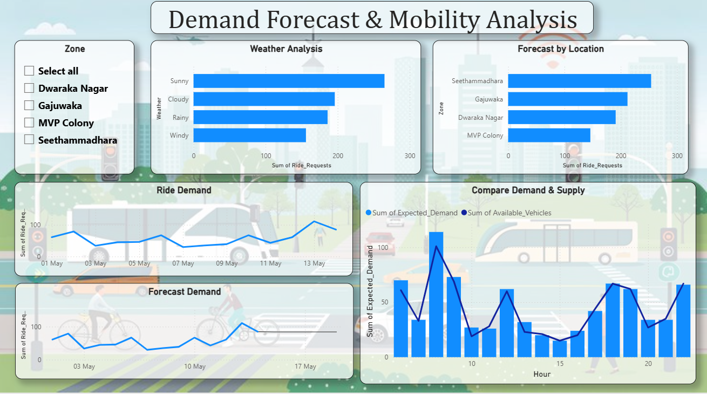
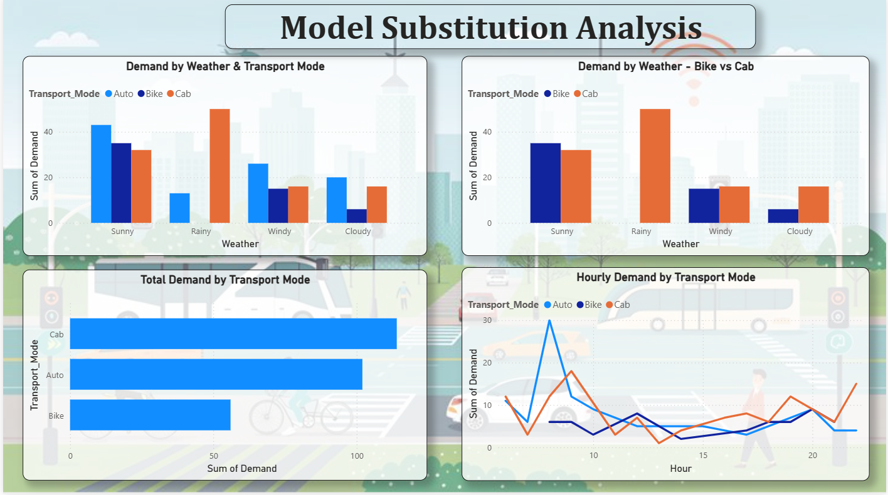

# Milestone 3 — Demand Forecasting & Mode Substitution Analysis

**City:** Visakhapatnam (Vizag)

Moved from description to prediction: forecast ride demand against vehicle supply, and
measured how travellers switch transport mode when the weather changes.

📄 **[Read the full report →](report/REPORT.md)**

## Contents

| Folder | Files |
|---|---|
| `data/` | `Vizag_Forecasting_Dataset_80.xlsx`, `PowerBI_Model_Substitution_80.xlsx` |
| `dashboard/` | `Demand-Forecast.pbix` + PNG, `Model-Substitution.pbix` + PNG |
| `presentation/` | `Milestone-3-Demand-Forecasting.pptx` |
| `report/` | `REPORT.md` |

## Key finding — what rain does to demand

| Mode | Sunny | Rainy | Change |
|---|---:|---:|---|
| Bike | 35 | **0** | −100% |
| Auto | 43 | 13 | −70% |
| Cab | 32 | **50** | **+56%** |

Rain does not stop people travelling — it changes **how** they travel. Riders abandon
open-air modes entirely and switch to cabs.

Other results: off-peak carries **59%** of ride requests, and **Gajuwaka** runs the
thinnest supply buffer in the city (+0.22) against the second-highest demand.

## Why there is no `code/` folder

The datasets for this milestone were supplied already cleaned, so no data-cleaning
step was required. All modelling and analysis was done directly in Power BI, and
those steps live inside the `.pbix` files.
