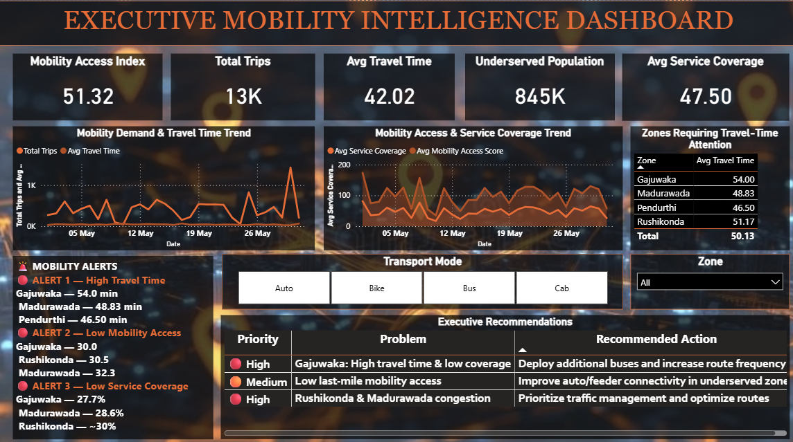

# Milestone 4 — Mobility Equity & Executive Intelligence Platform

**City:** Visakhapatnam (Vizag) · **Weeks 7–8**

City agencies can see overall ridership, but not *who is being left behind*. This
milestone delivered three integrated dashboards combining equity scoring, demand
forecasting and executive decision support.

📄 **[Read the full report →](report/REPORT.md)**

## Contents

| Folder | Files |
|---|---|
| `data/` | `vizag_mobility_equity_updated.xlsx` (96 trip records, May 2024) |
| `dashboard/` | `Milestone-4-Dashboard.pbix` (3 dashboards) |
| `presentation/` | `Milestone-4-Mobility-Equity.pptx` |
| `report/` | `REPORT.md` |

## The three dashboards

1. **Mobility Equity** — every zone scored against a citywide access index of **0.513**
2. **Forecasting & Anomaly Detection** — flagged the 30 May demand spike (~1,900 trips
   vs a 600–700 average) and the 10 May Pendurthi service dip
3. **Executive Mobility Intelligence** — consolidated alerts and prioritised actions

## Key finding

**845,000 residents are underserved citywide.**

**Gajuwaka is the clearest priority:** worst access score (0.30), worst service coverage
(27.7%), longest travel time (54.0 min) — and the largest population of any zone
(320,000). Rushikonda scores equally badly but holds only 60,000 people, so the same
investment reaches a fifth as many residents.

Access tracks route provision almost linearly: Seethammadhara has 24 routes and scores
0.85; Rushikonda has 6 and scores 0.30.

## Why there is no `code/` folder

The equity dataset was supplied already cleaned, so no data-cleaning step was
required. The Mobility Access Index and all three dashboards were built directly
in Power BI, and those steps live inside the `.pbix` file.
