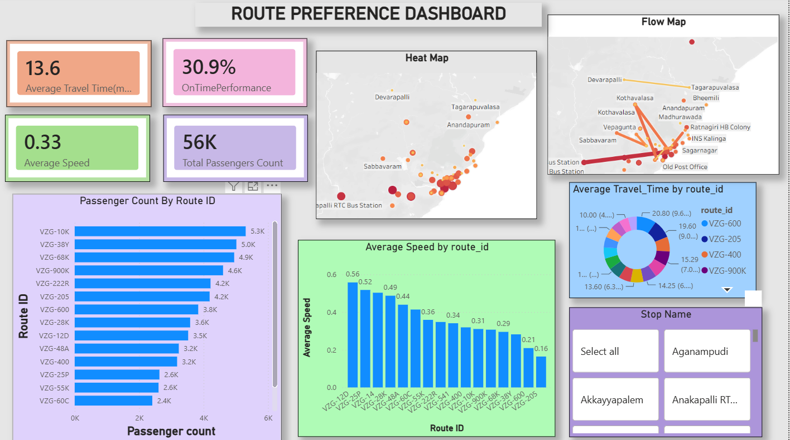

# UrbanPulse — Smart City Mobility Intelligence Platform

> Capstone project for the **Infosys Springboard Virtual Internship**
> Built by a team of 4 across 4 milestones · Bangalore & Visakhapatnam



---

## The problem

Cities generate transport data from buses, metro, ride-hailing apps, cycling systems,
traffic sensors and weather stations — but each source sits in its own silo. Planners
never see the network as a whole, which leads to congestion, poor route planning,
delayed services and slow decision-making.

## The solution

UrbanPulse combines these sources into one centralised platform with interactive
dashboards, maps and reports — so planners can monitor traffic, analyse transport
performance, identify congestion, and see **which communities are being left behind**.

---

## Milestones

| # | Milestone | City | Headline finding |
|---|---|---|---|
| 1 | **[Data Acquisition, Cleaning & Modelling](Milestone-1/)** | Bangalore | 4 siloed datasets unified into a star schema on a shared `Zone` key; 8,936 traffic records enriched |
| 2 | **[Route Preference & Transit Performance](Milestone-2/)** | Vizag | Only **30.9%** of bus services arrive on time; delay scales with route length |
| 3 | **[Demand Forecasting & Mode Substitution](Milestone-3/)** | Vizag | In rain, bike demand falls to **zero** while cab demand rises **+56%** |
| 4 | **[Mobility Equity & Executive Intelligence](Milestone-4/)** | Vizag | **845,000** residents underserved; Gajuwaka is the top priority |

---

## Headline results

| Metric | Value |
|---|---|
| Traffic records modelled | 8,936 |
| Bus routes analysed | 16 (43 stops, 56,106 passenger movements) |
| On-time performance | 30.9% |
| Citywide mobility access index | 0.513 |
| Residents identified as underserved | 845,000 |
| Dashboards delivered | 7 across Power BI and Tableau |

---

## Repository structure

Every milestone folder uses the same five sub-folders, so you always know where to look:

```
UrbanPulse-Infosys-Internship/
├── README.md                  <- you are here
├── CONTRIBUTING.md            <- how the team adds files
│
├── Milestone-1/               Bangalore · data cleaning & star schema
│   ├── README.md              <- summary of the milestone
│   ├── data/                  <- datasets (.csv, .xlsx)
│   ├── code/                  <- cleaning & modelling (.py, .ipynb)
│   ├── dashboard/             <- .pbix / .twbx + screenshots
│   ├── presentation/          <- the PPT presented (.pptx)
│   └── report/REPORT.md       <- full written report
│
├── Milestone-2/   (same 5 folders)  Vizag · transit performance
├── Milestone-3/   (no code/)        Vizag · forecasting & mode substitution
└── Milestone-4/   (no code/)        Vizag · mobility equity
```

Milestones 3 and 4 have no `code/` folder: their datasets arrived already cleaned, so
no cleaning step was needed and all modelling was done directly in Power BI.

**Start with each milestone's `report/REPORT.md`** — that's where the analysis,
figures and recommendations live.

---

## Tools & tech

| Area | Tools |
|---|---|
| Data cleaning & modelling | Python (pandas, numpy), Jupyter Notebook |
| Dashboards | Power BI (`.pbix`), Tableau (`.twbx`) |
| Data sources | GTFS transit feeds, traffic sensors, weather API, Census demographics |
| Presentation | Microsoft PowerPoint |
| Version control | Git + GitHub |

---

## How to open the dashboards

- **Power BI (`.pbix`)** — install [Power BI Desktop](https://powerbi.microsoft.com/desktop/) (free), then open the file
- **Tableau (`.twbx`)** — install [Tableau Public](https://public.tableau.com/) (free), then open the file

To view without installing anything, open the `.png` screenshots in each
`dashboard/` folder.

---

## Team

| Member | GitHub |
|---|---|
| Dnyaneshwari Girase | [@Nano88-hub](https://github.com/Nano88-hub) |
| Tejasvi Kushwaha | [@Tejasvi-0907](https://github.com/Tejasvi-0907) |
| _name to be added_ | [@EvanglinCleetus](https://github.com/EvanglinCleetus) |
| _name to be added_ | [@Dslbharathi28](https://github.com/Dslbharathi28) |

### How we worked

We deliberately did **not** split into fixed roles. Responsibilities rotated each
milestone — whoever built the presentation one time built the dashboard the next, while
another member sourced and cleaned the data.

Every member worked across all five areas: data collection, data cleaning, dashboard
development, analysis and reporting, and presentation. The intent was that all four of
us finished the internship able to do the whole pipeline, rather than each of us
specialising in one slice of it.

---

## A note on the data

Sample sizes in Milestones 2–4 are small (80–96 records). Findings are directional and
demonstrate the analytical approach; they are not statistically robust population
estimates. Each report documents its own limitations.

---

## License

The team's own work — code, dashboards, reports and presentations — is released under
the [MIT License](LICENSE).

**The datasets are not.** They remain the property of their original sources (Infosys
Springboard, government open data portals, GTFS transit feeds) and are included here for
academic demonstration only.

---

## Acknowledgement

Developed as part of the **Infosys Springboard Virtual Internship**.
Thanks to our mentor and the Springboard team for their guidance.
